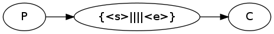

This is an H1
=============

This is an H2
-------------

<ul id="ProjectSubmenu">
    <li><a href="/projects/markdown/" title="Markdown Project Page">Main</a></li>
    <li><a class="selected" title="Markdown Basics">Basics</a></li>
    <li><a href="/projects/markdown/syntax" title="Markdown Syntax Documentation">Syntax</a></li>
    <li><a href="/projects/markdown/license" title="Pricing and License Information">License</a></li>
    <li><a href="/projects/markdown/dingus" title="Online Markdown Web Form">Dingus</a></li>
</ul>

<blockquote>
  
For example.

</blockquote>

  abc

<!--
 comment
-->

# comment
